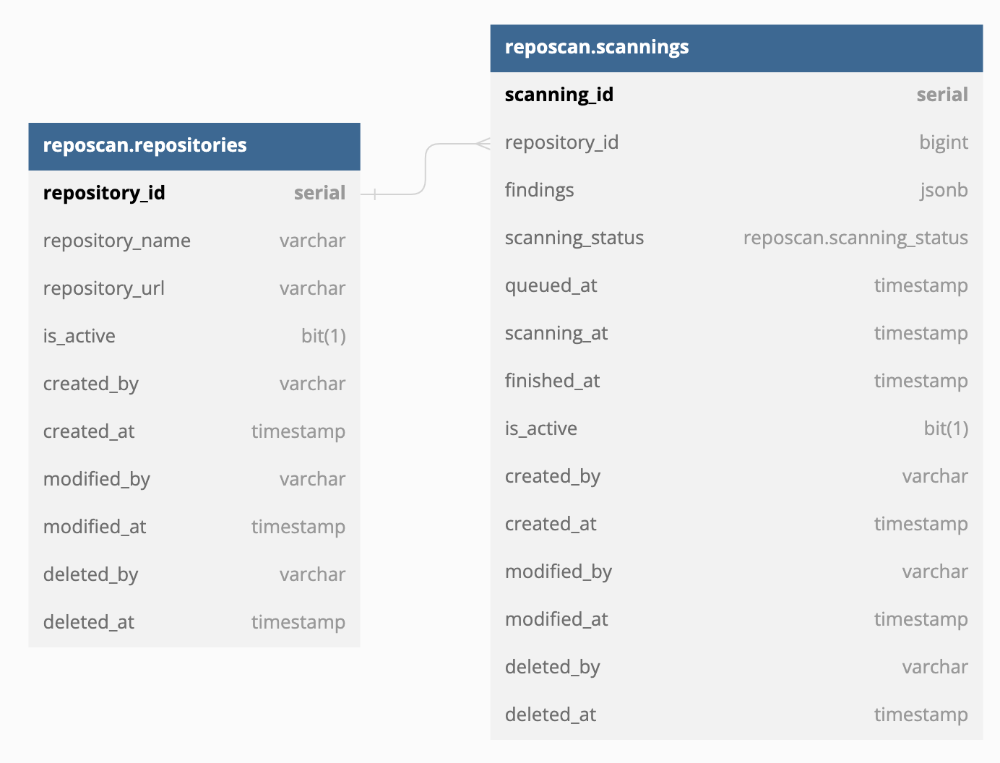
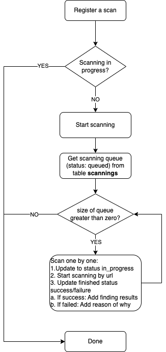

# Documentation

## Reps-scanner Schema


## Scanning workflow


## APIs
### API Get repository list
`GET <hostname>:8080/v1/repositories`

Get list of repositories.

**Inputs**

Field  | Type  | Location  | Description
------------- | ------------- | ------------- | -------------
**limit** *(optional)* | integer  | query | Element amount in one page (10 items by default)
**page** *(optional)* | integer | query | Page offset (1 by default)

**Outputs**

| Result  | Type | Description |
| ------------- | ------------- | ------------- |
| **repository_id** | integer | Repository ID |
| **repository_name** | string | Repository Name |
| **repository_url** | string | Repository Url |
| **is_active** | boolean | `false` is inactive, `true` is active |

**Status**

| Status | Message |
| ------------- | ------------- |
| 200 | Success |
| 400 | Invalid query provided |

**Example**

Request
```bash
$ curl -X GET 'localhost:8080/v1/repositories' \
  -H 'Content-Type: application/json'
```
Response
```json
{
    "status": 200,
    "message": {
        "en": "Success",
        "vn": "Success"
    },
    "data": [
        {
            "repository_id": 4,
            "repository_name": "Blockchain on Go",
            "repository_url": "github.com/trungkh/blockchain-on-go",
            "is_active": true
        },
        {
            "repository_id": 3,
            "repository_name": "JQuery",
            "repository_url": "github.com/jquery/jquery",
            "is_active": true
        }
    ],
    "meta": null
}
```
### API Create new repository
`POST <hostname>:8080/v1/repository`

Create new repository.

**Inputs**

Field  | Type  | Location  | Description
------------- | ------------- | ------------- | -------------
**repository_name** *(required)* | string  | body | Repository Name
**repository_url** *(required)* | string | body | Repository Url

**Outputs**

| Result  | Type | Description |
| ------------- | ------------- | ------------- |
| **repository_id** | integer | Repository ID |
| **repository_name** | string | Repository Name |
| **repository_url** | string | Repository Url |
| **is_active** | boolean | `false` is inactive, `true` is active |

**Status**

| Status | Message |
| ------------- | ------------- |
| 201 | Success |
| 400 | Invalid payload provided |
| 400 | Invalid url provided |

**Example**

Request
```bash
$ curl -X POST 'localhost:8080/v1/repository' \
  -H 'Content-Type: application/json' \
  -d '{
    "repository_name": "JQuery",
    "repository_url": "https://github.com/jquery/jquery"
  }'
```
Response
```json
{
    "status": 201,
    "message": {
        "en": "Success",
        "vn": "Success"
    },
    "data": [
        {
            "repository_id": 3,
            "repository_name": "JQuery",
            "repository_url": "github.com/jquery/jquery",
            "is_active": true
        }
    ],
    "meta": null
}
```
### API Edit repository
`PUT <hostname>:8080/v1/repository/{repository_id}`

Edit existing repository by given *{repository_id}*.

**Inputs**

Field  | Type  | Location  | Description
------------- | ------------- | ------------- | -------------
**repository_id** *(required)* | integer | path | Repository ID
**repository_name** *(optional)* | string  | body | Repository Name
**repository_url** *(optional)* | string | body | Repository Url
**is_active** *(optional)* | boolean | body | `false` is inactive, `true` is active

**Outputs**

| Result  | Type | Description |
| ------------- | ------------- | ------------- |
| **repository_id** | integer | Repository ID |
| **repository_name** | string | Repository Name |
| **repository_url** | string | Repository Url |
| **is_active** | boolean | `false` is inactive, `true` is active |

**Status**

| Status | Message |
| ------------- | ------------- |
| 200 | Success |
| 400 | Repository not found |
| 400 | Invalid payload provided |
| 400 | Invalid url provided |
| 406 | Nothing to update |

**Example**

Request
```bash
$ curl -X PUT 'localhost:8080/v1/repository/3' \
  -H 'Content-Type: application/json' \
  -d '{
    "is_active": false
  }'
```
Response
```json
{
    "status": 200,
    "message": {
        "en": "Success",
        "vn": "Success"
    },
    "data": [
        {
            "repository_id": 3,
            "repository_name": "JQuery",
            "repository_url": "github.com/jquery/jquery",
            "is_active": false
        }
    ],
    "meta": null
}
```
### API Delete repository
`DEL <hostname>:8080/v1/repository/{repository_id}`

Delete existing repository by given *{repository_id}*.

**Inputs**

Field  | Type  | Location  | Description
------------- | ------------- | ------------- | -------------
**repository_id** *(required)* | integer | path | Repository ID

**Output Status**

| Status | Message |
| ------------- | ------------- |
| 200 | Success |
| 400 | Repository not found |

**Example**

Request
```bash
$ curl -X DEL 'localhost:8080/v1/repository/3' \
  -H 'Content-Type: application/json'
```
Response
```json
{
    "status": 200,
    "message": {
        "en": "Success",
        "vn": "Success"
    },
    "data": null,
    "meta": null
}
```
### API Trigger a scan
`POST <hostname>:8080/v1/repository/{repository_id}/scan`

Trigger a scan by given *{repository_id}*.

**Inputs**

Field  | Type  | Location  | Description
------------- | ------------- | ------------- | -------------
**repository_id** *(required)* | integer  | path | Repository ID

**Outputs**

| Result  | Type | Description |
| ------------- | ------------- | ------------- |
| **scanning_id** | integer | Scanning ID |
| **repository_id** | integer | Repository ID |
| **scanning_status** | string | Scanning Status<br />`queued` is in queue<br />`in_progress` is in progress<br />`success` is successful<br />`failure` is failed |
| **findings** | array[object] | Finding results |
| **queued_at** | timestampt | Queued Time |
| **scanning_at** | timestampt | Scanning Time |
| **finished_at** | timestampt | Finished Time |

**Status**

| Status | Message |
| ------------- | ------------- |
| 201 | Success |
| 400 | Repository not found |
| 400 | Repository is inactive |

**Example**

Request
```bash
$ curl -X POST 'localhost:8080/v1/repository/3/scan' \
  -H 'Content-Type: application/json'
```
Response
```json
{
    "status": 201,
    "message": {
        "en": "Success",
        "vn": "Success"
    },
    "data": {
        "scanning_id": 17,
        "repository_id": 3,
        "findings": {},
        "scanning_status": "queued",
        "queued_at": "2022-11-28T12:02:46.556284Z",
        "scanning_at": null,
        "finished_at": null
    },
    "meta": null
}
```
### API Get scanning results
`GET <hostname>:8080/v1/scanning/result`

Get list of recent results.

**Inputs**

Field  | Type  | Location  | Description
------------- | ------------- | ------------- | -------------
**limit** *(optional)* | integer  | query | Element amount in one page (10 items by default)
**page** *(optional)* | integer | query | Page offset (1 by default)
**sort** *(optional)* | string | query | Sort by created time:<br />`asc` - ascending<br />`desc` - descending (by default)
**status** *(optional)* | string | query | Filter scanning status:<br />`all` - get all (by default)<br />`queued` - in queue<br />`in_progress` - in progress<br />`success` - successful<br />`failure` - failed

**Outputs**

| Result  | Type | Description |
| ------------- | ------------- | ------------- |
| **scanning_id** | integer | Scanning ID |
| **repository_name** | string | Repository Name |
| **repository_url** | string | Repository Url |
| **scanning_status** | string | Scanning Status:<br />`queued` is in queue<br />`in_progress` is in progress<br />`success` is successful<br />`failure` is failed |
| **findings** | array[object] | Finding results |
| **queued_at** | timestampt | Queued Time |
| **scanning_at** | timestampt | Scanning Time |
| **finished_at** | timestampt | Finished Time |

**Status**

| Status | Message |
| ------------- | ------------- |
| 200 | Success |
| 400 | Invalid query provided |

**Example**

Request
```bash
$ curl -X GET 'localhost:8080/v1/scanning/result' \
  -H 'Content-Type: application/json'
```
Response
```json
{
    "status": 200,
    "message": {
        "en": "Success",
        "vn": "Success"
    },
    "data": [
        {
            "scanning_id": 17,
            "repository_name": "JQuery",
            "repository_url": "github.com/jquery/jquery",
            "findings": [
                {
                    "ID": "24d9c5378e6311f75bfb38246683dab15aafbd1feb725f25c26d0ff7fa254170",
                    "Line": 1,
                    "Action": "filename",
                    "Comment": "Can contain credentials for NPM registries",
                    "FileURL": "https://api.github.com/repos/jquery/jquery/blob/main/.npmrc",
                    "FilePath": ".npmrc",
                    "CommitURL": "",
                    "CommitHash": "",
                    "Description": "NPM configuration file",
                    "LineContent": "save-e",
                    "CommitAuthor": "",
                    "CommitMessage": "",
                    "IsTestContext": false,
                    "RepositoryURL": "https://api.github.com/repos/jquery/jquery",
                    "RepositoryName": "jquery",
                    "RepositoryOwner": ""
                }
            ],
            "scanning_status": "success",
            "queued_at": "2022-11-28T12:02:46.556284Z",
            "scanning_at": "2022-11-28T12:02:46.565262Z",
            "finished_at": "2022-11-28T12:02:49.866722Z"
        }
    ],
    "meta": null
}
```
                